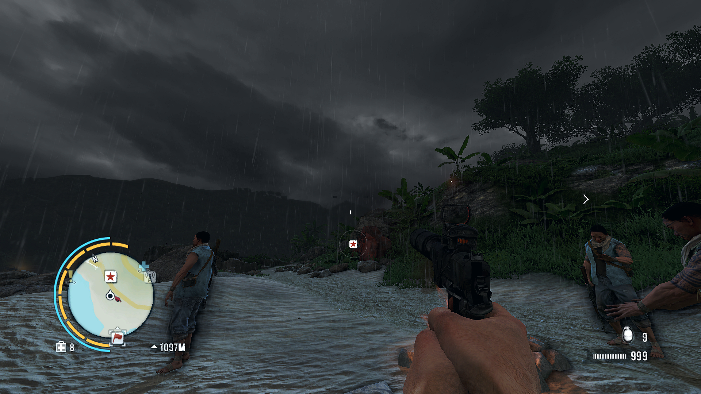
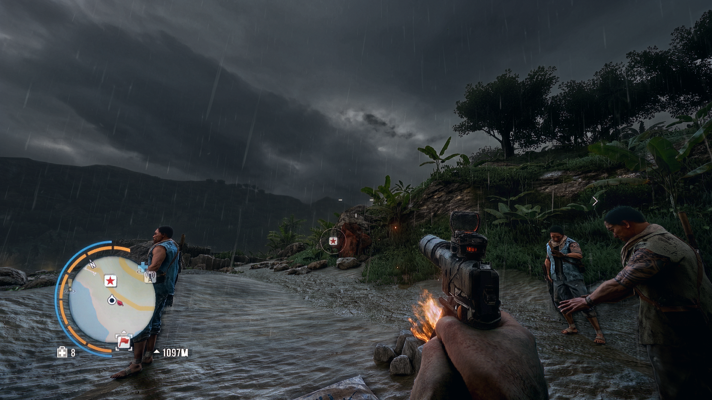
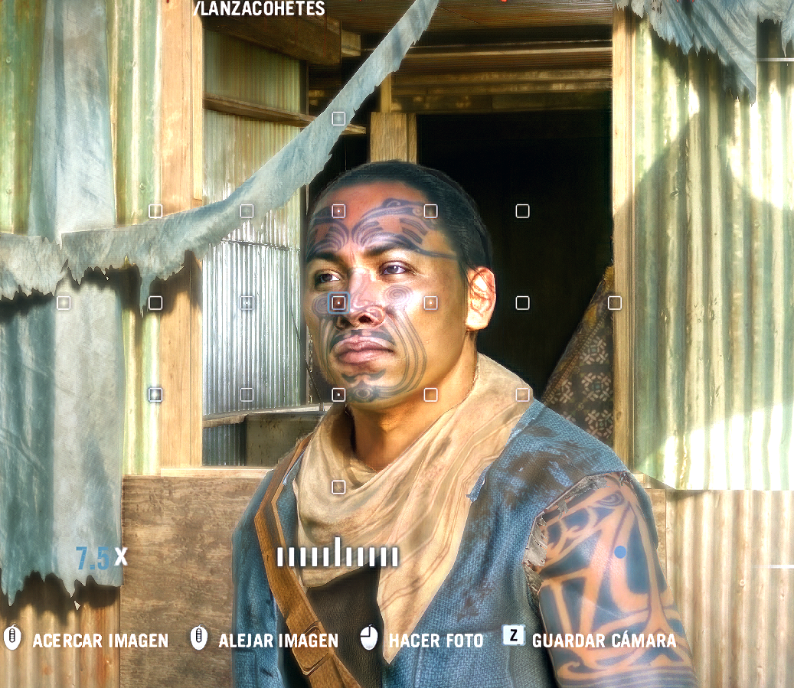

# NeuroShade

[](https://github.com/wanbnn/neuroshade/actions/workflows/ci.yml)
[](LICENSE)
[](COMPATIBILITY.md)
[](COMPATIBILITY.md)
[](https://github.com/wanbnn/neuroshade/releases)

NeuroShade adds configurable GPU post-processing and neural rendering to compatible games through a Vulkan layer. Use the same launcher across games, with controls in the in-game overlay and profiles that survive updates.

**Linux + AMD.** DirectX 9/11 games use DXVK; DirectX 12 games use VKD3D-Proton. Native Vulkan games use the layer directly. Native Windows installation is not available yet.

---

### 💸 Send help, I burned all my GPT money

For the love of God, toss a coin to your boy.  
I spent my entire budget feeding the GPT goblin. 🤖💀

[☕ Fund my questionable AI decisions](https://buymeacoffee.com/wanbnn)

---


## Before / after

Captures supplied from Far Cry 3, shown as a visual example. NeuroShade is not tied to this game. These are different frames, not a controlled image-quality benchmark.

| Before | After |
| --- | --- |
| [](images/antes.png) | [](images/depois.png) |

<details>
<summary>Character detail</summary>



</details>

## Install

Download and run the installer; it verifies the pinned bundle SHA-256 before installing into `~/.local`, without root:

```sh
curl -fsSL https://raw.githubusercontent.com/wanbnn/neuroshade/main/install.sh -o /tmp/neuroshade-install.sh
sh /tmp/neuroshade-install.sh
```

The DLSSNR bundle includes the weights, native C++ host, shaders, and Vulkan layers for 32-bit and 64-bit games. No Python or manual DLL extraction is needed for inference. Existing profiles are preserved. You can also download the archive from [Releases](https://github.com/wanbnn/neuroshade/releases), extract it and run its `install.sh`.

**Current DLSSNR requirements:** AMD `gfx1200` (qualified on RX 9060 XT), ROCm/HIP 7, Linux x86-64 and a **1920×1080** game output. This initial binary bundle was built on Arch Linux; compatible system libraries are required. It does not add support for other GPU architectures or arbitrary resolutions. The native host checks the GPU when loading the network.

## Play

In a game's Steam launch options:

```sh
~/.local/bin/neuroshade-run --nr %command%
```

For a 32-bit game launched through Steam/Proton, use:

```sh
~/.local/bin/neuroshade-run --nr --32 %command%
```

For a native Vulkan game or a Wine command:

```sh
~/.local/bin/neuroshade-run --nr /path/to/game
~/.local/bin/neuroshade-run --nr --32 wine /path/to/game.exe
```

`--nr` selects the managed DLSSNR profile and starts the native host on demand. Direct executable launches can detect 32/64-bit; use `--32` when a launcher hides the game's executable. The host stays available between launches; use one neural-rendered game at a time.

Open the overlay with **Home**. Its pipeline controls enable/disable reconstruction; **F8** exposes NR Style, NR Preset, NR Intensity, Automatic Mask and structure/tone controls. **Apply** updates the running model; **Save** persists the profile. See [overlay controls](docs/DLSSNR_OVERLAY.md).

- **NR Style:** Default, Natural and Cinematic conditioning.
- **NR Intensity:** 0–2; 0 preserves the input, 1 is the normal network result, values above 1 amplify the change.
- **NR Preset:** the recovered package contains one weight preset. Other selections explicitly fall back to preset 1; they are not separate X2/X3 networks.

Omit `--nr` for the standard post-processing profile. To keep separate settings for a game, copy `~/.config/neuroshade/profiles/dlssnr.json` and select it with `NEUROSHADE_PROFILE`. Custom native profiles must also supply their model's running host through `NEUROSHADE_RUNTIME_SOCKET`; the automatic host lifecycle is for the managed profile.

Flatpak launchers need the layer, installation and environment exposed inside their sandbox. Games with anti-cheat may disallow injected layers. “Compatible games” does not mean every game or every launcher works without configuration; see [compatibility](COMPATIBILITY.md).

## What is included

The native DLSSNR path uses a 64-bit C++/HIP host, resident GPU weights and activations, reusable HIP Graphs and Vulkan/HIP shared buffers. It coexists with the existing PyTorch, ONNX and MIGraphX integrations; those optional backends have their own dependencies.

The current network consumes final color. External motion/depth input and visual/performance parity with the NVIDIA add-on are not established. Historical measurements and implementation limits are documented in [native runtime](docs/DLSSNR_NATIVE.md), [GPU transport](docs/DLSSNR_GPU_TRANSPORT.md) and [parity gaps](docs/DLSSNR_PARITY_GAPS.md).

## Troubleshooting and development

```sh
~/.local/bin/neuroshade doctor
~/.local/bin/neuroshade setup
```

Session logs are under `${XDG_STATE_HOME:-~/.local/state}/neuroshade`. Native host startup logs are under `${XDG_RUNTIME_DIR}/neuroshade-native/host.log` (or the NeuroShade state directory when XDG_RUNTIME_DIR is absent). Set `NEUROSHADE_DIAGNOSTICS=1` for additional launch diagnostics. Normal launches skip expensive GPU diagnostic utilities.

[Build and developer reference](docs/DEVELOPMENT.md) · [Specification](SPEC.md) · [Compatibility](COMPATIBILITY.md) · [Releases](https://github.com/wanbnn/neuroshade/releases)

The NeuroShade source code is MIT licensed. The recovered model artifacts have separate provenance recorded in their metadata; the source-code license does not relicense those artifacts.
